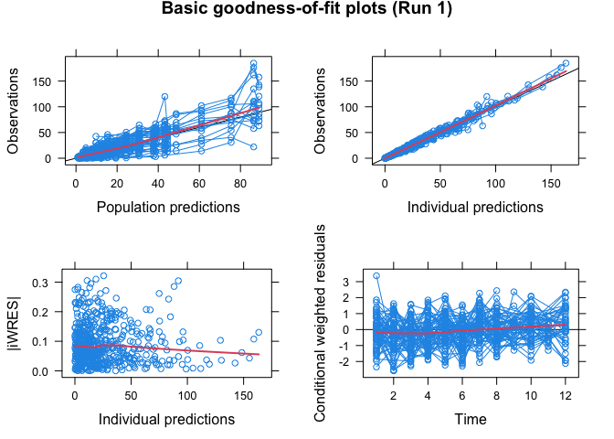

<!-- README.md is generated from README.Rmd. Please edit that file -->
Xpose 4 <a href="https://uupharmacometrics.github.io/xpose4/"></a>
=======================================================================================================================

[](https://travis-ci.org/UUPharmacometrics/xpose4) [](https://CRAN.R-project.org/package=xpose4) [](https://codecov.io/github/UUPharmacometrics/xpose4?branch=master)

by Andrew C. Hooker, Mats O. Karlsson and E. Niclas Jonsson

<http://xpose.sourceforge.net/>

Introduction
------------

Xpose 4 is a collection of functions to be used as a model building aid for nonlinear mixed-effects (population) analysis using NONMEM. It facilitates data set checkout, exploration and visualization, model diagnostics, candidate covariate identification and model comparison.

Installation
------------

To install xpose you will need R (&gt;= version 2.2.0). Download the latest version of R from <http://www.r-project.org>.
To install Xpose in R use one of the following methods:

-   latest stable release -- From CRAN. Write at the R command line:

    ``` r
    install.packages("xpose4")
    ```

-   Latest development version -- from Github. Note that the command below installs the "master" (development) branch; if you want the release branch from Github add `ref="release"` to the `install_github()` call.

    ``` r
    # install.packages("devtools")
    devtools::install_github("UUPharmacometrics/xpose4")
    ```

Running Xpose 4
---------------

Start R

To use the classic menu system, type at the R command prompt:

``` r
library(xpose4)
xpose4()
```

Each function is independently available from the command line, once the Xpose library is loaded.

-   First we create a set of files from a NONMEM run

``` r
library(xpose4)
#> Loading required package: lattice
cur.files <- dir() # current files in temp directory

simprazExample(overwrite = TRUE) # write files from an example NONMEM run
(new.files <- dir()[!(dir() %in% cur.files)])  # what files are new here?
#> [1] "run1.ext"    "run1.lst"    "run1.mod"    "simpraz.dta" "xptab1"
```

-   Then we can import our files to Xpose

``` r
xpdb <- xpose.data(1) 
#> 
#> Looking for NONMEM table files.
#>     Reading xptab1 
#> Table files read.
#> 
#> Looking for NONMEM simulation table files.
#> No simulated table files read.
```

-   Display goodness-of-fit plots

``` r
  basic.gof(xpdb)
```



-   clean up files that were created to show these examples

``` r
unlink(new.files)
```

More help is available in the online documentation, which can be found by typing (for example) `?xpose4` at the R command line.

The Xpose 4 Bestiary
--------------------

A more detailed description of Xpose with example plots and explanaitions for most of the functions in the package is available in our Bestiarium: <http://xpose.sourceforge.net/bestiarium_v1.0.pdf>

Don't Panic
-----------

Andrew Hooker (andrew.hooker at farmbio.uu.se) should be able to get you an answer if you run into trouble. The website <http://xpose.sf.net> should also be of help.

Release Schedule
----------------

Bugfix releases will be released regularly, fixing any problems that are found.

License
-------

Xpose 4 is free software: you can redistribute it and/or modify it under the terms of the GNU Lesser General Public License as published by the Free Software Foundation, either version 3 of the License, or (at your option) any later version.

This program is distributed in the hope that it will be useful, but WITHOUT ANY WARRANTY; without even the implied warranty of MERCHANTABILITY or FITNESS FOR A PARTICULAR PURPOSE. See the GNU Lesser General Public License for more details <http://www.gnu.org/licenses/>.

Known Bugs
----------

None at present, but there will certainly be a few
